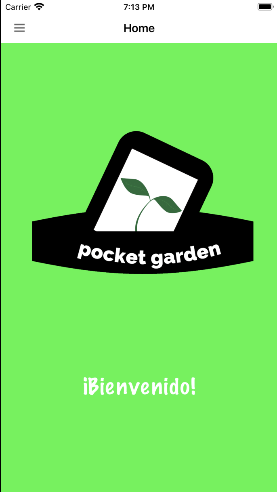
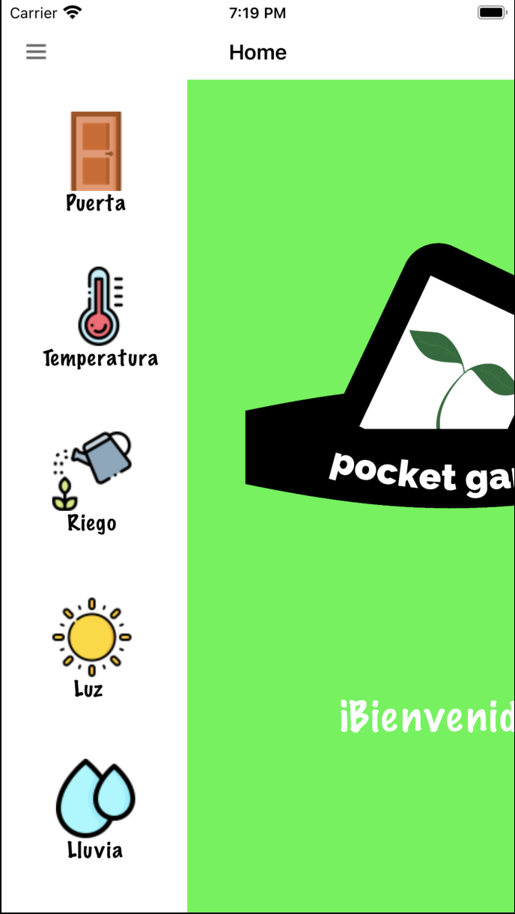
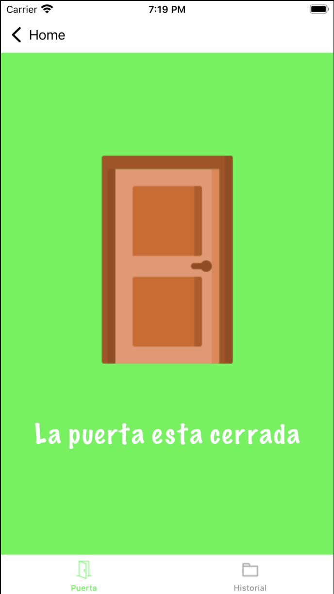
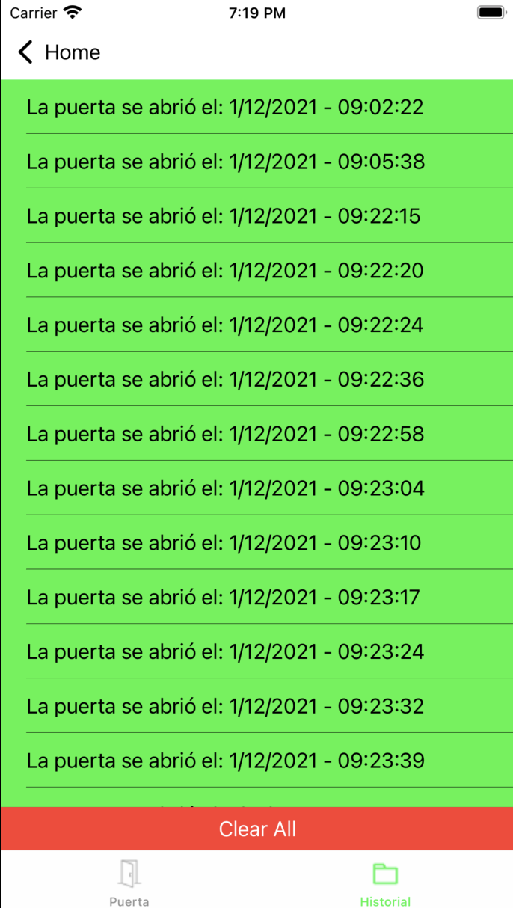
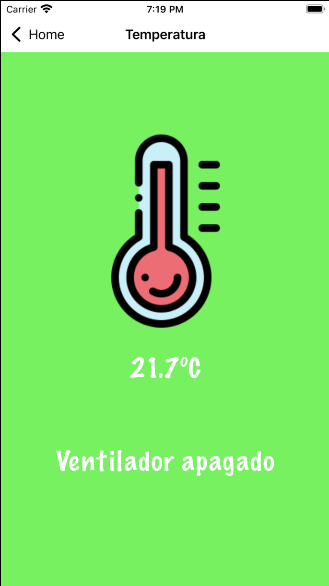
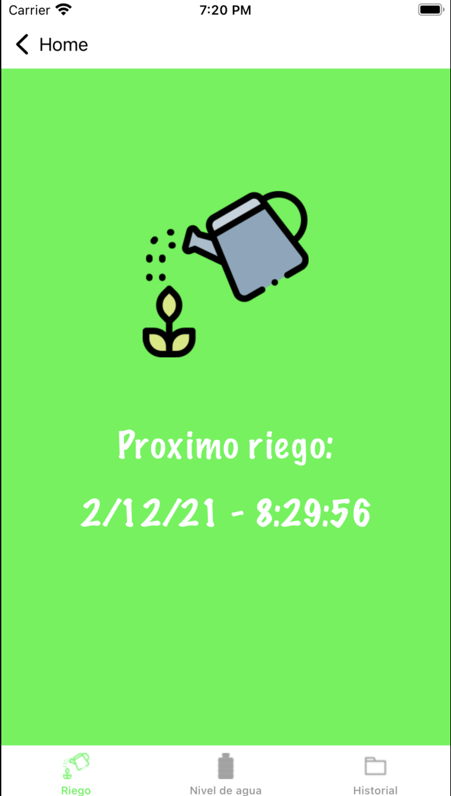
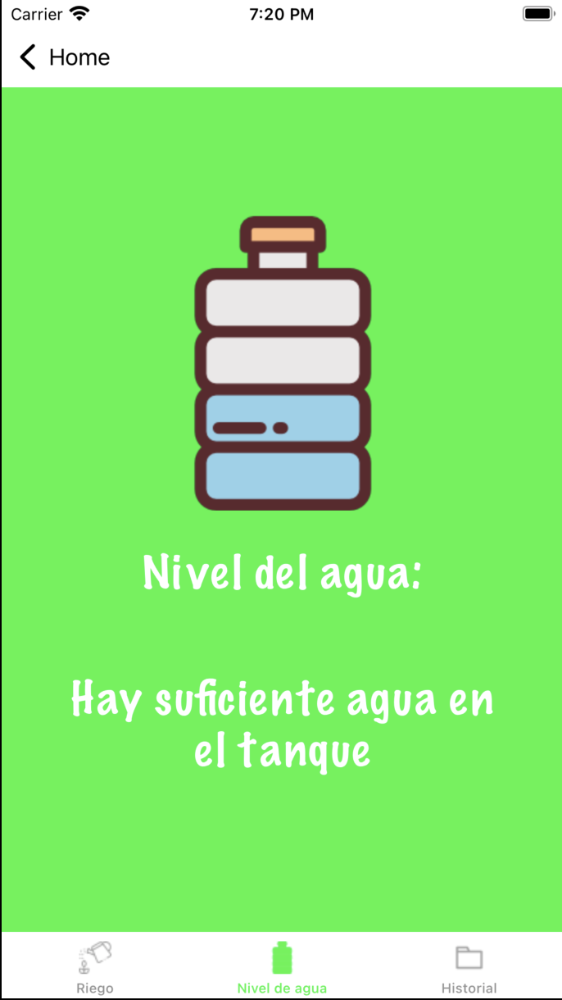
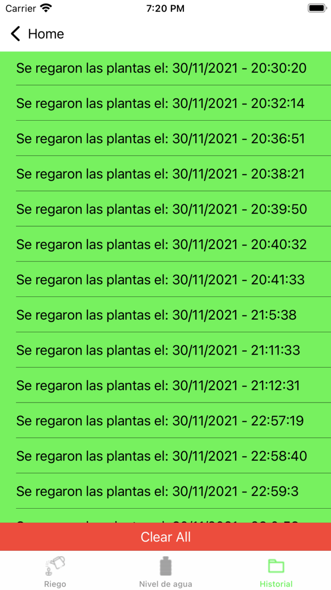
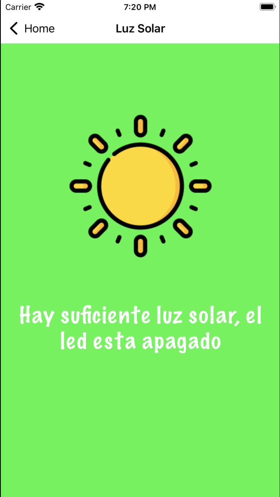
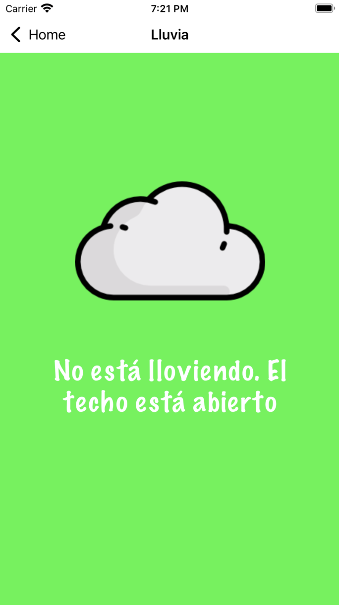

# Pocket-Garden

***

## Description:
Mobile application that is connected to a Firebase database to control and access data obtained by sensors working with NodeMCU. Featureas include temperature monitoring to turn on fans, humidity of the plant to water it automatically and get a history section in the app, detect rain to close roof, detect if the plant is getting enough UV light to determine wether or not turn on an artificial light, among other things.

***

## Application

***

## Model

***

## Home Screen

***

## Door Screen

***

## Temperature Screen

***

## Watering Screen

***

## Light Screen

***

## Rain Screen

